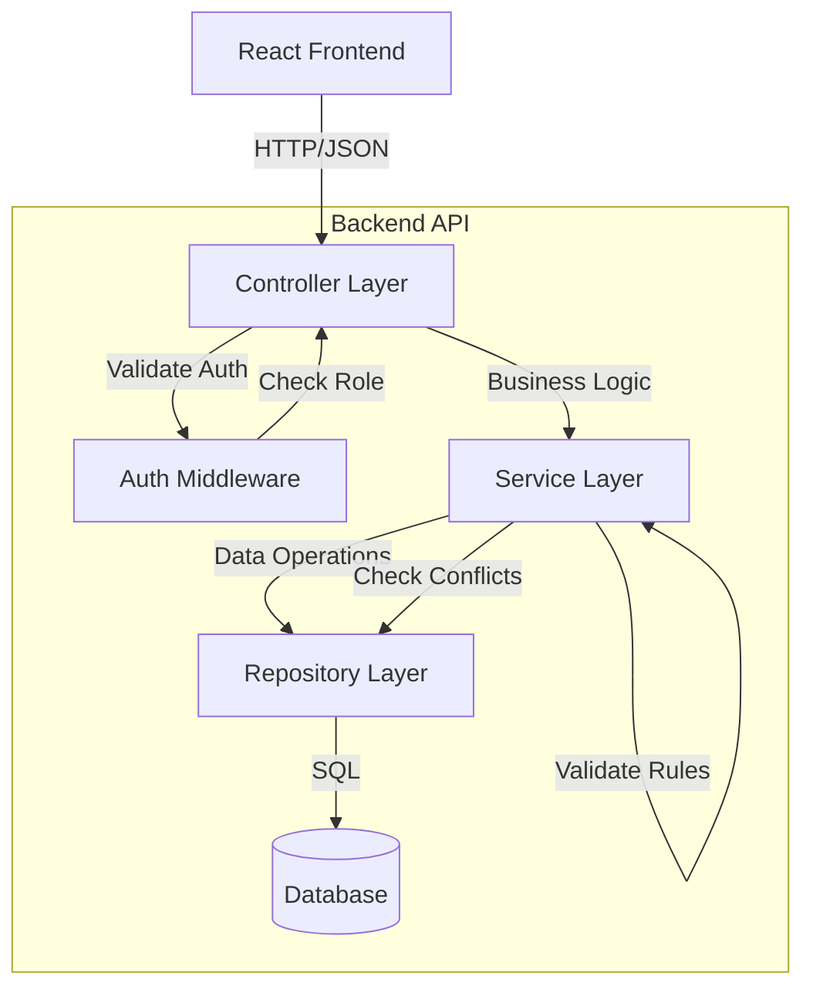
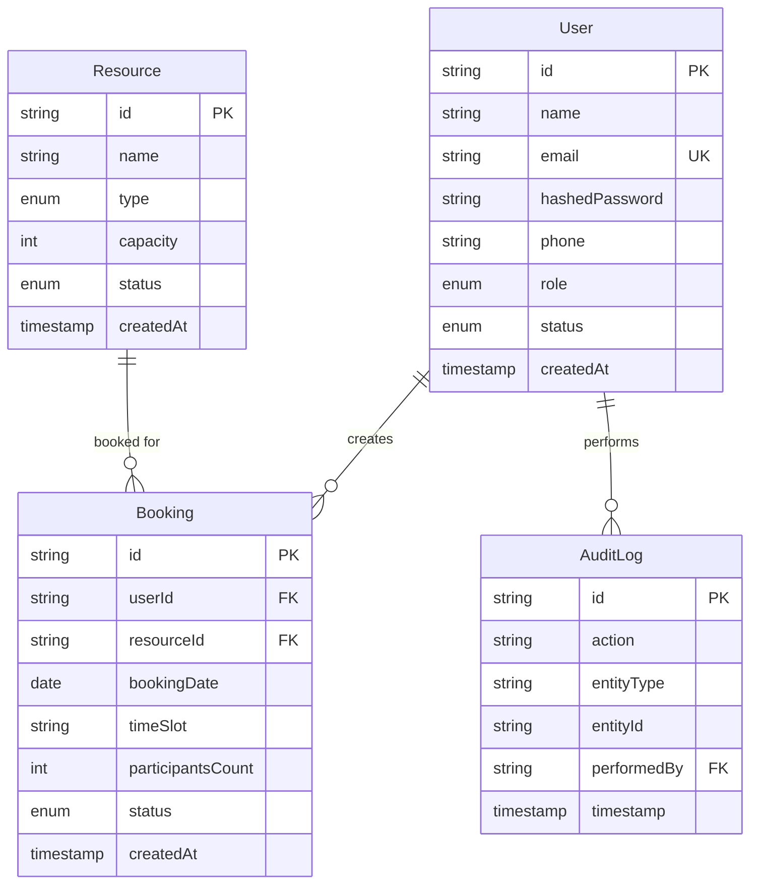

# Design Document: Campus Resource Management System Backend

## Overview

The Campus Resource Management System backend is a RESTful API built with clean layered architecture following the Controller → Service → Repository → Database pattern. The system provides JWT-based authentication, role-based access control (ADMIN, STAFF, STUDENT), and comprehensive business logic for managing campus resources and bookings.

### Technology Stack Considerations

Based on the requirements for a RESTful backend with clean architecture, the following technology stacks are commonly used:

- **Java/Spring Boot**: Enterprise-grade with excellent support for layered architecture, Spring Security for JWT, Spring Data JPA for repositories
- **Node.js/TypeScript with Express**: Lightweight, matches frontend TypeScript types, good ecosystem for JWT and ORMs (TypeORM, Prisma)
- **Python/FastAPI or Django**: Strong typing support, excellent for rapid development, good ORM support
- **.NET Core/C#**: Enterprise-grade, excellent layered architecture support, Entity Framework for data access

The design will use pseudocode that can be adapted to any of these stacks. The implementation language will be chosen during task creation.

### Architecture Layers

1. **Controller Layer**: Handles HTTP requests/responses, input validation, authentication/authorization
2. **Service Layer**: Contains business logic, orchestrates operations, enforces business rules
3. **Repository Layer**: Data access abstraction, database operations
4. **Database Layer**: Relational database with proper schema and constraints

### Key Design Decisions

- **JWT Authentication**: Stateless authentication suitable for RESTful APIs
- **Role-Based Access Control**: Implemented via middleware/interceptors at controller layer
- **Soft Delete**: Users are deactivated (status = INACTIVE) rather than deleted
- **Auto-Approval**: STAFF bookings auto-approved, STUDENT bookings require admin approval
- **Database Constraints**: Unique constraints and foreign keys enforce data integrity
- **Audit Logging**: Optional feature for tracking administrative actions

## Architecture

### System Architecture Diagram



### Request Flow

1. **Authentication Flow**:
   - Client sends credentials to `/auth/login`
   - Controller validates input
   - Service verifies credentials against database
   - Service generates JWT token
   - Controller returns token to client

2. **Protected Endpoint Flow**:
   - Client sends request with JWT in Authorization header
   - Auth middleware validates JWT and extracts user info
   - Auth middleware checks role-based permissions
   - Controller receives authenticated request
   - Service executes business logic
   - Repository performs database operations
   - Response flows back through layers

3. **Booking Creation Flow**:
   - Client sends booking request
   - Auth middleware validates JWT
   - Controller validates input format
   - Service validates business rules (user active, resource available, no double booking, etc.)
   - Service determines approval status based on user role
   - Repository creates booking record
   - Service creates audit log (if applicable)
   - Controller returns success response

## Components and Interfaces

### 1. Authentication Module

**AuthController**:
```
POST /auth/login
  Input: { email: string, password: string }
  Output: { token: string, user: UserDTO }
  Errors: 401 if invalid credentials
```

**AuthService**:
```
function login(email: string, password: string) -> (token: string, user: User)
  user = userRepository.findByEmail(email)
  if user is null or user.status != ACTIVE:
    throw UnauthorizedException
  
  if not verifyPassword(password, user.hashedPassword):
    throw UnauthorizedException
  
  token = generateJWT(user.id, user.role)
  return (token, user)

function generateJWT(userId: string, role: string) -> string
  payload = { userId, role, exp: currentTime + tokenExpiry }
  return sign(payload, secretKey)

function verifyJWT(token: string) -> { userId: string, role: string }
  payload = verify(token, secretKey)
  if payload.exp < currentTime:
    throw UnauthorizedException
  return payload
```

### 2. User Management Module

**UserController**:
```
POST /users (ADMIN only)
  Input: { name: string, email: string, password: string, phone?: string, role: UserRole }
  Output: UserDTO
  Errors: 400 validation, 403 forbidden, 409 duplicate email

GET /users (ADMIN only)
  Output: UserDTO[]
  Errors: 403 forbidden

PUT /users/{id} (ADMIN only)
  Input: { name?: string, email?: string, phone?: string, role?: UserRole }
  Output: UserDTO
  Errors: 400 validation, 403 forbidden, 404 not found, 409 duplicate email

PATCH /users/{id}/deactivate (ADMIN only)
  Output: UserDTO
  Errors: 403 forbidden, 404 not found
```

**UserService**:
```
function createUser(data: CreateUserDTO) -> User
  if userRepository.existsByEmail(data.email):
    throw ConflictException("Email already exists")
  
  hashedPassword = hashPassword(data.password)
  user = new User(
    name: data.name,
    email: data.email,
    hashedPassword: hashedPassword,
    phone: data.phone,
    role: data.role,
    status: ACTIVE
  )
  
  return userRepository.save(user)

function getAllUsers() -> User[]
  return userRepository.findAll()

function updateUser(id: string, data: UpdateUserDTO) -> User
  user = userRepository.findById(id)
  if user is null:
    throw NotFoundException("User not found")
  
  if data.email and data.email != user.email:
    if userRepository.existsByEmail(data.email):
      throw ConflictException("Email already exists")
  
  user.update(data)
  return userRepository.save(user)

function deactivateUser(id: string) -> User
  user = userRepository.findById(id)
  if user is null:
    throw NotFoundException("User not found")
  
  user.status = INACTIVE
  return userRepository.save(user)
```

**UserRepository**:
```
interface UserRepository:
  findById(id: string) -> User | null
  findByEmail(email: string) -> User | null
  existsByEmail(email: string) -> boolean
  findAll() -> User[]
  save(user: User) -> User
```

### 3. Resource Management Module

**ResourceController**:
```
POST /resources (ADMIN only)
  Input: { name: string, type: ResourceType, capacity: number, status?: ResourceStatus }
  Output: ResourceDTO
  Errors: 400 validation, 403 forbidden

GET /resources (authenticated)
  Output: ResourceDTO[]

GET /resources/{id} (authenticated)
  Output: ResourceDTO
  Errors: 404 not found

PUT /resources/{id} (ADMIN only)
  Input: { name?: string, type?: ResourceType, capacity?: number, status?: ResourceStatus }
  Output: ResourceDTO
  Errors: 400 validation, 403 forbidden, 404 not found
```

**ResourceService**:
```
function createResource(data: CreateResourceDTO) -> Resource
  if data.capacity <= 0:
    throw ValidationException("Capacity must be greater than 0")
  
  resource = new Resource(
    name: data.name,
    type: data.type,
    capacity: data.capacity,
    status: data.status or AVAILABLE
  )
  
  return resourceRepository.save(resource)

function getAllResources() -> Resource[]
  return resourceRepository.findAll()

function getResourceById(id: string) -> Resource
  resource = resourceRepository.findById(id)
  if resource is null:
    throw NotFoundException("Resource not found")
  return resource

function updateResource(id: string, data: UpdateResourceDTO) -> Resource
  resource = resourceRepository.findById(id)
  if resource is null:
    throw NotFoundException("Resource not found")
  
  if data.capacity and data.capacity <= 0:
    throw ValidationException("Capacity must be greater than 0")
  
  resource.update(data)
  return resourceRepository.save(resource)
```

**ResourceRepository**:
```
interface ResourceRepository:
  findById(id: string) -> Resource | null
  findAll() -> Resource[]
  save(resource: Resource) -> Resource
```

### 4. Booking Management Module

**BookingController**:
```
POST /bookings (authenticated)
  Input: { resourceId: string, bookingDate: string, timeSlot: string, participantsCount: number }
  Output: BookingDTO
  Errors: 400 validation, 404 not found, 409 conflict

GET /bookings (ADMIN only)
  Output: BookingDTO[]
  Errors: 403 forbidden

GET /bookings/my (STAFF/STUDENT)
  Output: BookingDTO[]

PATCH /bookings/{id}/approve (ADMIN only)
  Output: BookingDTO
  Errors: 403 forbidden, 404 not found

PATCH /bookings/{id}/reject (ADMIN only)
  Output: BookingDTO
  Errors: 403 forbidden, 404 not found

PATCH /bookings/{id}/cancel (owner only)
  Output: BookingDTO
  Errors: 400 validation, 403 forbidden, 404 not found
```

**BookingService**:
```
function createBooking(userId: string, userRole: string, data: CreateBookingDTO) -> Booking
  // Step 1: Verify user exists and is active
  user = userRepository.findById(userId)
  if user is null:
    throw NotFoundException("User not found")
  if user.status != ACTIVE:
    throw ValidationException("User account is inactive")
  
  // Step 2: Verify resource exists and is available
  resource = resourceRepository.findById(data.resourceId)
  if resource is null:
    throw NotFoundException("Resource not found")
  if resource.status != AVAILABLE:
    throw ValidationException("Resource is not available for booking")
  
  // Step 3: Validate booking date is not in the past
  if data.bookingDate < currentDate:
    throw ValidationException("Booking date cannot be in the past")
  
  // Step 4: Validate participants count
  if data.participantsCount > resource.capacity:
    throw ValidationException("Participants count exceeds resource capacity")
  
  // Step 5: Check for double booking
  existingBooking = bookingRepository.findConflictingBooking(
    data.resourceId,
    data.bookingDate,
    data.timeSlot,
    [PENDING, APPROVED]
  )
  if existingBooking is not null:
    throw ConflictException("Resource already booked for this time slot")
  
  // Step 6: Determine status based on role
  status = (userRole == STAFF) ? APPROVED : PENDING
  
  // Step 7: Create booking
  booking = new Booking(
    userId: userId,
    resourceId: data.resourceId,
    bookingDate: data.bookingDate,
    timeSlot: data.timeSlot,
    participantsCount: data.participantsCount,
    status: status
  )
  
  return bookingRepository.save(booking)

function getAllBookings() -> Booking[]
  return bookingRepository.findAll()

function getMyBookings(userId: string) -> Booking[]
  return bookingRepository.findByUserId(userId)

function approveBooking(bookingId: string, adminId: string) -> Booking
  booking = bookingRepository.findById(bookingId)
  if booking is null:
    throw NotFoundException("Booking not found")
  
  booking.status = APPROVED
  booking = bookingRepository.save(booking)
  
  // Create audit log
  auditLogService.log(
    action: "APPROVE_BOOKING",
    entityType: "Booking",
    entityId: bookingId,
    performedBy: adminId
  )
  
  return booking

function rejectBooking(bookingId: string, adminId: string) -> Booking
  booking = bookingRepository.findById(bookingId)
  if booking is null:
    throw NotFoundException("Booking not found")
  
  booking.status = REJECTED
  booking = bookingRepository.save(booking)
  
  // Create audit log
  auditLogService.log(
    action: "REJECT_BOOKING",
    entityType: "Booking",
    entityId: bookingId,
    performedBy: adminId
  )
  
  return booking

function cancelBooking(bookingId: string, userId: string) -> Booking
  booking = bookingRepository.findById(bookingId)
  if booking is null:
    throw NotFoundException("Booking not found")
  
  if booking.userId != userId:
    throw ForbiddenException("Cannot cancel another user's booking")
  
  if booking.bookingDate <= currentDate:
    throw ValidationException("Cannot cancel booking on or after booking date")
  
  booking.status = CANCELLED
  return bookingRepository.save(booking)
```

**BookingRepository**:
```
interface BookingRepository:
  findById(id: string) -> Booking | null
  findAll() -> Booking[]
  findByUserId(userId: string) -> Booking[]
  findConflictingBooking(resourceId: string, date: string, timeSlot: string, statuses: BookingStatus[]) -> Booking | null
  save(booking: Booking) -> Booking
```

### 5. Audit Logging Module (Optional)

**AuditLogService**:
```
function log(action: string, entityType: string, entityId: string, performedBy: string) -> void
  auditLog = new AuditLog(
    action: action,
    entityType: entityType,
    entityId: entityId,
    performedBy: performedBy,
    timestamp: currentTimestamp
  )
  
  auditLogRepository.save(auditLog)
```

**AuditLogRepository**:
```
interface AuditLogRepository:
  save(auditLog: AuditLog) -> AuditLog
  findAll() -> AuditLog[]
```

### 6. Middleware/Interceptors

**AuthMiddleware**:
```
function authenticate(request: HttpRequest) -> AuthContext
  authHeader = request.headers["Authorization"]
  if authHeader is null or not authHeader.startsWith("Bearer "):
    throw UnauthorizedException("Missing or invalid authorization header")
  
  token = authHeader.substring(7) // Remove "Bearer "
  payload = authService.verifyJWT(token)
  
  return AuthContext(userId: payload.userId, role: payload.role)

function requireRole(allowedRoles: Role[]) -> Middleware
  return function(request: HttpRequest, authContext: AuthContext):
    if authContext.role not in allowedRoles:
      throw ForbiddenException("Insufficient permissions")
```

## Data Models

### User Entity
```
entity User:
  id: string (primary key, auto-generated UUID)
  name: string (required, max 100 chars)
  email: string (required, unique, max 255 chars)
  hashedPassword: string (required)
  phone: string (optional, max 20 chars)
  role: enum(ADMIN, STAFF, STUDENT) (required)
  status: enum(ACTIVE, INACTIVE) (required, default ACTIVE)
  createdAt: timestamp (auto-generated)
```

### Resource Entity
```
entity Resource:
  id: string (primary key, auto-generated UUID)
  name: string (required, max 100 chars)
  type: enum(Lab, Classroom, Event Hall, Computer) (required)
  capacity: integer (required, > 0)
  status: enum(AVAILABLE, MAINTENANCE, BLOCKED) (required, default AVAILABLE)
  createdAt: timestamp (auto-generated)
```

### Booking Entity
```
entity Booking:
  id: string (primary key, auto-generated UUID)
  userId: string (foreign key -> User.id, required)
  resourceId: string (foreign key -> Resource.id, required)
  bookingDate: date (required, not in past)
  timeSlot: string (required, format: "HH:MM-HH:MM")
  participantsCount: integer (required, > 0)
  status: enum(PENDING, APPROVED, REJECTED, CANCELLED) (required)
  createdAt: timestamp (auto-generated)
  
  constraints:
    - unique(resourceId, bookingDate, timeSlot) where status in (PENDING, APPROVED)
    - foreign key userId references User(id)
    - foreign key resourceId references Resource(id)
```

### AuditLog Entity (Optional)
```
entity AuditLog:
  id: string (primary key, auto-generated UUID)
  action: string (required, max 50 chars)
  entityType: string (required, max 50 chars)
  entityId: string (required)
  performedBy: string (foreign key -> User.id, required)
  timestamp: timestamp (auto-generated)
```

### Database Schema Diagram



## Correctness Properties

*A property is a characteristic or behavior that should hold true across all valid executions of a system—essentially, a formal statement about what the system should do. Properties serve as the bridge between human-readable specifications and machine-verifiable correctness guarantees.*


### Authentication and Token Management

**Property 1: Valid login generates valid JWT**
*For any* user with valid credentials and ACTIVE status, logging in should return a JWT token that can be successfully verified and contains the correct userId and role.
**Validates: Requirements 1.1, 1.3**

**Property 2: Invalid credentials reject authentication**
*For any* login attempt with invalid credentials (wrong password, non-existent email, or INACTIVE user), the system should return a 401 Unauthorized error.
**Validates: Requirements 1.2, 1.4, 1.5, 10.2**

**Property 3: Password hashing invariant**
*For any* user creation or password update, the stored password in the database should be hashed (not equal to the plaintext password provided).
**Validates: Requirements 1.6, 3.1**

### Role-Based Access Control

**Property 4: ADMIN full access**
*For any* operation in the system, when performed by a user with ADMIN role and valid JWT, the operation should be allowed to proceed (not return 403).
**Validates: Requirements 2.1**

**Property 5: Role-based operation authorization**
*For any* operation with role restrictions, when performed by a user without the required role, the system should return a 403 Forbidden error.
**Validates: Requirements 2.7, 6.4, 7.4, 8.2, 10.3**

**Property 6: STAFF booking permissions**
*For any* STAFF user with valid JWT, creating bookings and viewing their own bookings should be allowed.
**Validates: Requirements 2.2, 2.4**

**Property 7: Resource read access**
*For any* authenticated user (ADMIN, STAFF, or STUDENT), viewing resources should be allowed.
**Validates: Requirements 2.3, 2.6**

**Property 8: User booking isolation**
*For any* STAFF or STUDENT user retrieving their bookings, the returned list should contain only bookings where userId matches the authenticated user's id.
**Validates: Requirements 6.2, 6.3**

### User Management

**Property 9: Email uniqueness constraint**
*For any* user creation or email update, if the email already exists in the system, the operation should return a 409 Conflict error.
**Validates: Requirements 3.2, 10.5**

**Property 10: Required field validation**
*For any* user creation with missing required fields (name or email), the system should return a 400 validation error with details about the missing fields.
**Validates: Requirements 3.3, 10.1**

**Property 11: User data completeness**
*For any* user retrieval operation, the returned user object should contain all required fields: id, name, email, phone, role, status, and createdAt.
**Validates: Requirements 3.4**

**Property 12: User update persistence**
*For any* valid user update operation, retrieving the user immediately after should return the updated values.
**Validates: Requirements 3.5**

**Property 13: User deactivation effect**
*For any* user deactivation operation, the user's status should be set to INACTIVE, and subsequent booking creation attempts by that user should be rejected.
**Validates: Requirements 3.6, 3.7, 5.1, 5.10**

### Resource Management

**Property 14: Resource capacity validation**
*For any* resource creation or update with capacity ≤ 0, the system should return a 400 validation error.
**Validates: Requirements 4.2, 10.1**

**Property 15: Resource required fields validation**
*For any* resource creation with missing required fields (name or type), the system should return a 400 validation error.
**Validates: Requirements 4.3, 10.1**

**Property 16: Resource creation default status**
*For any* resource creation without explicit status, the created resource should have status AVAILABLE.
**Validates: Requirements 4.1**

**Property 17: Resource retrieval by ID**
*For any* existing resource ID, retrieving that resource should return the resource details; for any non-existent ID, the system should return a 404 Not Found error.
**Validates: Requirements 4.5, 4.6, 10.4**

**Property 18: Resource availability requirement for booking**
*For any* booking creation attempt on a resource with status MAINTENANCE or BLOCKED, the system should reject the booking with a validation error.
**Validates: Requirements 4.8, 5.2**

### Booking Creation and Validation

**Property 19: Booking foreign key validation**
*For any* booking creation with non-existent userId or resourceId, the system should return a 404 Not Found error.
**Validates: Requirements 5.8, 5.9, 9.1, 10.4**

**Property 20: Past date rejection**
*For any* booking creation with bookingDate in the past, the system should return a 400 validation error.
**Validates: Requirements 5.3, 10.1**

**Property 21: Capacity constraint enforcement**
*For any* booking creation where participantsCount exceeds the resource's capacity, the system should return a 400 validation error.
**Validates: Requirements 5.4, 10.1**

**Property 22: Double booking prevention**
*For any* booking creation, if there exists another booking with the same resourceId, bookingDate, and timeSlot with status PENDING or APPROVED, the system should return a 409 Conflict error.
**Validates: Requirements 5.5, 9.2, 10.5**

**Property 23: Role-based auto-approval**
*For any* valid booking creation by a STAFF user, the created booking should have status APPROVED; for any valid booking creation by a STUDENT user, the created booking should have status PENDING.
**Validates: Requirements 5.6, 5.7**

### Booking Management

**Property 24: ADMIN booking visibility**
*For any* ADMIN user retrieving all bookings, the returned list should contain all bookings in the system regardless of userId.
**Validates: Requirements 6.1**

**Property 25: Booking approval state transition**
*For any* booking with status PENDING, when an ADMIN approves it, the booking status should change to APPROVED.
**Validates: Requirements 7.1**

**Property 26: Booking rejection state transition**
*For any* booking with status PENDING, when an ADMIN rejects it, the booking status should change to REJECTED.
**Validates: Requirements 7.2**

**Property 27: Booking cancellation ownership**
*For any* booking cancellation attempt, if the authenticated user's ID does not match the booking's userId, the system should return a 403 Forbidden error.
**Validates: Requirements 8.2, 10.3**

**Property 28: Booking cancellation time constraint**
*For any* booking cancellation attempt where the bookingDate is today or in the past, the system should return a 400 validation error.
**Validates: Requirements 8.3, 10.1**

**Property 29: Successful cancellation state transition**
*For any* valid booking cancellation (owner, before booking date), the booking status should change to CANCELLED.
**Validates: Requirements 8.1**

### Error Handling

**Property 30: Consistent error response format**
*For any* error response (400, 401, 403, 404, 409), the response should be in JSON format and include consistent fields for error identification and details.
**Validates: Requirements 10.6**

### Audit Logging (Optional Feature)

**Property 31: Admin action audit trail**
*For any* admin action (booking approval, booking rejection, resource update), an audit log entry should be created with action, entityType, entityId, performedBy, and timestamp fields.
**Validates: Requirements 11.1, 11.2, 11.3**

### Frontend Integration

**Property 32: Response data structure compatibility**
*For any* API response returning User, Resource, or Booking data, the JSON structure should match the TypeScript interfaces defined in the frontend (all required fields present with correct types).
**Validates: Requirements 12.3**

## Error Handling

### Error Response Format

All error responses follow a consistent JSON structure:

```json
{
  "error": {
    "code": "ERROR_CODE",
    "message": "Human-readable error message",
    "details": {
      // Optional additional context
    },
    "timestamp": "2024-01-15T10:30:00Z"
  }
}
```

### Error Categories

**400 Bad Request**:
- Missing required fields
- Invalid data format
- Business rule violations (past date, capacity exceeded, etc.)
- Example codes: `VALIDATION_ERROR`, `INVALID_DATE`, `CAPACITY_EXCEEDED`

**401 Unauthorized**:
- Missing JWT token
- Invalid JWT token
- Expired JWT token
- Invalid credentials
- Example codes: `MISSING_TOKEN`, `INVALID_TOKEN`, `INVALID_CREDENTIALS`

**403 Forbidden**:
- Insufficient role permissions
- Attempting to access another user's resources
- Example codes: `INSUFFICIENT_PERMISSIONS`, `ACCESS_DENIED`

**404 Not Found**:
- Resource not found by ID
- User not found by ID
- Booking not found by ID
- Example codes: `USER_NOT_FOUND`, `RESOURCE_NOT_FOUND`, `BOOKING_NOT_FOUND`

**409 Conflict**:
- Duplicate email
- Double booking (same resource, date, time slot)
- Example codes: `DUPLICATE_EMAIL`, `BOOKING_CONFLICT`

**500 Internal Server Error**:
- Unexpected server errors
- Database connection failures
- Example codes: `INTERNAL_ERROR`, `DATABASE_ERROR`

### Exception Handling Strategy

```
Controller Layer:
  - Catch all exceptions from service layer
  - Map exceptions to appropriate HTTP status codes
  - Format error responses consistently
  - Log errors for debugging

Service Layer:
  - Throw domain-specific exceptions (ValidationException, ConflictException, etc.)
  - Include detailed error messages
  - Don't expose internal implementation details

Repository Layer:
  - Throw data access exceptions
  - Let service layer handle and translate exceptions
```

## Testing Strategy

### Dual Testing Approach

The system requires both unit testing and property-based testing for comprehensive coverage:

**Unit Tests**: Focus on specific examples, edge cases, and error conditions
- Specific user creation scenarios
- Specific booking conflict scenarios
- Integration between components
- Edge cases (boundary values, empty inputs, etc.)

**Property-Based Tests**: Verify universal properties across all inputs
- Generate random valid/invalid inputs
- Test properties hold for all generated cases
- Minimum 100 iterations per property test
- Each test references its design document property

### Property-Based Testing Configuration

**Framework Selection** (language-dependent):
- Java: jqwik or QuickTheories
- TypeScript/JavaScript: fast-check
- Python: Hypothesis
- .NET/C#: FsCheck

**Test Configuration**:
- Minimum 100 iterations per property test
- Configurable seed for reproducibility
- Shrinking enabled for minimal failing examples

**Test Tagging Format**:
Each property-based test must include a comment tag:
```
// Feature: campus-resource-management-backend, Property 22: Double booking prevention
```

### Test Coverage Requirements

**Authentication Module**:
- Unit tests: Login with specific credentials, token expiration scenarios
- Property tests: Properties 1, 2, 3

**User Management Module**:
- Unit tests: Specific user creation/update scenarios, deactivation flow
- Property tests: Properties 9, 10, 11, 12, 13

**Resource Management Module**:
- Unit tests: Specific resource creation/update scenarios
- Property tests: Properties 14, 15, 16, 17, 18

**Booking Management Module**:
- Unit tests: Specific booking scenarios, approval/rejection flows
- Property tests: Properties 19, 20, 21, 22, 23, 24, 25, 26, 27, 28, 29

**Authorization Module**:
- Unit tests: Specific role-based access scenarios
- Property tests: Properties 4, 5, 6, 7, 8

**Error Handling**:
- Unit tests: Specific error scenarios for each error type
- Property tests: Property 30

**Audit Logging** (if implemented):
- Unit tests: Specific audit log creation scenarios
- Property tests: Property 31

**Frontend Integration**:
- Unit tests: Response format validation for specific endpoints
- Property tests: Property 32

### Integration Testing

Beyond unit and property tests, integration tests should verify:
- End-to-end booking flow (create user → create resource → create booking → approve)
- Authentication flow with actual JWT generation and validation
- Database transaction handling
- CORS configuration with actual cross-origin requests

### Test Data Generation

For property-based tests, generators should produce:
- **Valid users**: Random names, emails, roles, statuses
- **Invalid users**: Missing fields, invalid emails, duplicate emails
- **Valid resources**: Random names, types, positive capacities
- **Invalid resources**: Zero/negative capacities, missing fields
- **Valid bookings**: Future dates, valid time slots, capacity within limits
- **Invalid bookings**: Past dates, conflicting time slots, over-capacity
- **Valid JWTs**: Properly signed tokens with valid expiration
- **Invalid JWTs**: Expired tokens, invalid signatures, missing claims

### Performance Testing Considerations

While not part of the core testing strategy, consider:
- Load testing for concurrent booking requests (double booking prevention under load)
- Database query performance with large datasets
- JWT validation performance under high request volume

## Implementation Notes

### CORS Configuration

For local development, configure CORS to allow:
- Origin: `http://localhost:5173` (Vite default) or configured frontend port
- Methods: GET, POST, PUT, PATCH, DELETE, OPTIONS
- Headers: Authorization, Content-Type
- Credentials: true (for cookies if used)

### JWT Configuration

- **Secret Key**: Store in environment variable, never commit to repository
- **Token Expiry**: Recommended 24 hours for development, shorter for production
- **Algorithm**: HS256 (HMAC with SHA-256) or RS256 (RSA with SHA-256)
- **Claims**: Include userId, role, issued-at (iat), expiration (exp)

### Database Configuration

- **Connection Pooling**: Configure appropriate pool size for expected load
- **Transactions**: Use transactions for operations that modify multiple tables
- **Indexes**: Add indexes on frequently queried fields (email, resourceId + bookingDate + timeSlot)
- **Migrations**: Use migration tool for schema versioning

### Password Hashing

- **Algorithm**: bcrypt (recommended) or Argon2
- **Salt Rounds**: 10-12 for bcrypt
- **Never**: Store plaintext passwords or use weak hashing (MD5, SHA1)

### Time Slot Format

Recommended format: `"HH:MM-HH:MM"` (24-hour format)
- Examples: `"09:00-10:00"`, `"14:30-16:00"`
- Validation: Start time < end time, valid hour/minute ranges
- Consider: 30-minute or 1-hour slot increments for consistency

### API Versioning

Consider adding API versioning for future compatibility:
- URL-based: `/api/v1/users`
- Header-based: `Accept: application/vnd.api+json; version=1`

### Documentation

**README.md should include**:
- Prerequisites (language runtime, database)
- Installation steps
- Environment variable configuration
- Database setup and migration commands
- Running the application
- Running tests
- API endpoint overview

**Postman Collection should include**:
- All endpoints with example requests
- Environment variables for base URL and token
- Pre-request scripts for authentication
- Example responses for success and error cases
